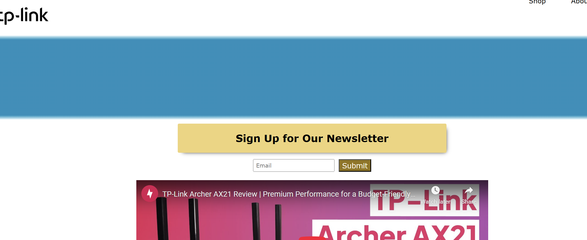

# landing-page-demo

A webpage that features a demo for a product landing page.

**Live-Demo:** [https://oendemann.github.io/landing-page-demo/]

---

---

## About The Page

A webpage that demos a landing page for a couple TP-Link routers. It is the 2nd last project in the responsive web design course on freeCodeCamp, which had specific tests that needed to succeed to fulfill the project's requirements, but allowed free-range on all other design choices.

---

## Built With

* **HTML:** Used to structure the landing page and provide content (text, images, and links).
* **CSS:** Used to design the webpage, adjust accessibility settings, and provide data for SEO.

---

## What I Learned

1. Simply making an image higher on the z-index than an element does not put it on top of the element's new background color. To fix this problem, I changed the image's position to absolute.
2. To supply a webpage with an embedded YouTube video, you can simply copy and past the html provided by YouTube.

## Acknowledgments

* Project idea and requirements from [freeCodeCamp.org](https://www.freecodecamp.org/)
* All product information, images and product links are the property of TP-Link Systems Inc. [tp-link.com](https://www.tp-link.com/us/)